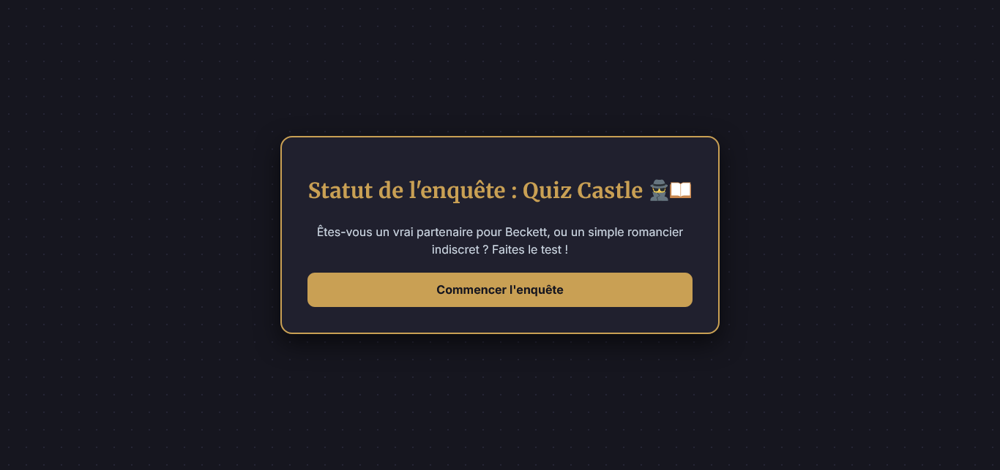
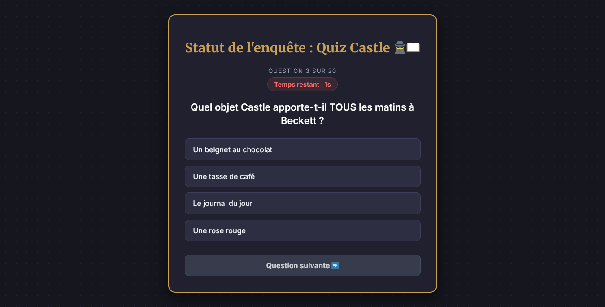

## 🕵️‍♂️📖 QUIZ CASTLE - TESTEZ VOS CONNAISSANCES

- Ecran du quiz :

## 🚀 Le challenge

Un site web de quiz interactif, immersif et entièrement _responsive_ dédié à la célèbre série télévisée policière **Castle**. Testez vos connaissances et découvrez si vous êtes un véritable détective du 12ème District ou un simple écrivain indiscret !

Le projet est développé uniquement avec les technologies web natives : **HTML5**, **CSS3 (moderne)** et **JavaScript (ES6+)**.

Cette application dispose de plusieurs fonctionnalités :

- 📚 **20 Questions Uniques** : Des questions variées allant des anecdotes faciles aux détails les plus pointus de la série.
- 🔀 **Questions Aléatoires** : L'ordre des questions change à chaque nouvelle partie grâce à l'algorithme de mélange _Fisher-Yates_.
- ⏱️ **Compte à Rebours Synchrone** : Le joueur dispose de 10 secondes par question. Si le temps s'écoule, la réponse correcte s'affiche automatiquement.
- 📱 **100% Mobile Friendly** : Design moderne et adaptatif (_Responsive Design_) conçu pour offrir une excellente expérience sur smartphones, tablettes et ordinateurs.
- ⚡ **Code Moderne** : un code propre et facilement maintenable.
- 🏆 **Écran de Résultats Personnalisé** : Un verdict unique et des répliques clin d'œil à la série vous attendent selon votre score final.
- 🎨 **Le design** : adopte une ambiance "polar / roman policier" à travers un thème sombre ponctué de touches dorées (`#c9a054`), rappelant les couvertures des livres de Richard Castle.

## 📸 Démonstration

Lien vers le projet :

## 🛠️ Projet développé avec

- Utilisation des balises sémantiques HTML5
- CSS3
- Flexbox
- Grid
- Animations CSS (transition, @keyframes)
- Importation d'un normaliseur : le fichier normalize.css
- Importation des polices "Inter" et "Merriweather"
- Page web responsive
- Commentaires HTML
- Commentaires CSS
- JavaScript
- Code JavaScript commenté
- addEventListener
- boucle for
- Condition if else / if else if else
- setInterval / clearInterval

## 📝 Licence

Ce projet a été réalisé à des fins éducatives et de divertissement. Les droits de la série _Castle_ et des personnages appartiennent à leurs créateurs et diffuseurs respectifs.
